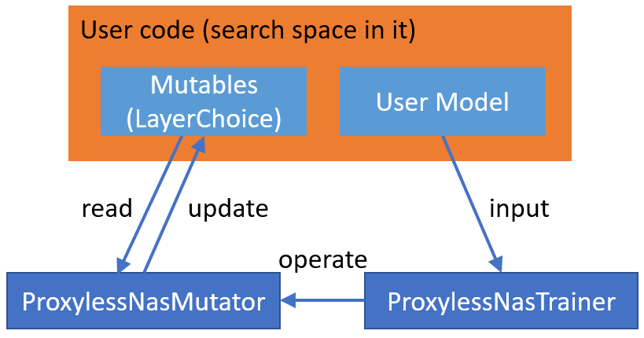

# ProxylessNAS on NNI

## Introduction

The paper [ProxylessNAS: Direct Neural Architecture Search on Target Task and Hardware](https://arxiv.org/pdf/1812.00332.pdf) removes proxy, it directly learn the architectures for large-scale target tasks and target hardware platforms. They address high memory consumption issue of differentiable NAS and reduce the computational cost to the same level of regular training while still allowing a large candidate set. Please refer to the paper for the details.

## Usage

To use ProxylessNAS training/searching approach, users need to specify search space in their model using [NNI NAS interface](NasInterface.md), e.g., `LayerChoice`, `InputChoice`. After defining and instantiating the model, the following work can be leaved to ProxylessNasTrainer by instantiating the trainer and passing the model to it.
```python
trainer = ProxylessNasTrainer(model,
                              model_optim=optimizer,
                              train_loader=data_provider.train,
                              valid_loader=data_provider.valid,
                              device=device,
                              warmup=True,
                              ckpt_path=args.checkpoint_path,
                              arch_path=args.arch_path)
trainer.train()
trainer.export(args.arch_path)
```
The complete example code can be found [here](https://github.com/microsoft/nni/tree/master/examples/nas/proxylessnas).

**Input arguments of ProxylessNasTrainer**

* **model** (*PyTorch model, required*) - The model that users want to tune/search. It has mutables to specify search space.
* **model_optim** (*PyTorch optimizer, required*) - The optimizer users want to train the model.
* **device** (*device, required*) - The devices that users provide to do the train/search. The trainer applies data parallel on the model for users.
* **train_loader** (*PyTorch data loader, required*) - The data loader for training set.
* **valid_loader** (*PyTorch data loader, required*) - The data loader for validation set.
* **label_smoothing** (*float, optional, default = 0.1*) - The degree of label smoothing.
* **n_epochs** (*int, optional, default = 120*) - The number of epochs to train/search.
* **init_lr** (*float, optional, default = 0.025*) - The initial learning rate for training the model.
* **binary_mode** (*'two', 'full', or 'full_v2', optional, default = 'full_v2'*) - The forward/backward mode for the binary weights in mutator. 'full' means forward all the candidate ops, 'two' means only forward two sampled ops, 'full_v2' means recomputing the inactive ops during backward.
* **arch_init_type** (*'normal' or 'uniform', optional, default = 'normal'*) - The way to init architecture parameters.
* **arch_init_ratio** (*float, optional, default = 1e-3*) - The ratio to init architecture parameters.
* **arch_optim_lr** (*float, optional, default = 1e-3*) - The learning rate of the architecture parameters optimizer.
* **arch_weight_decay** (*float, optional, default = 0*) - Weight decay of the architecture parameters optimizer.
* **grad_update_arch_param_every** (*int, optional, default = 5*) - Update architecture weights every this number of minibatches.
* **grad_update_steps** (*int, optional, default = 1*) - During each update of architecture weights, the number of steps to train architecture weights.
* **warmup** (*bool, optional, default = True*) - Whether to do warmup.
* **warmup_epochs** (*int, optional, default = 25*) - The number of epochs to do during warmup.
* **arch_valid_frequency** (*int, optional, default = 1*) - The frequency of printing validation result.
* **load_ckpt** (*bool, optional, default = False*) - Whether to load checkpoint.
* **ckpt_path** (*str, optional, default = None*) - checkpoint path, if load_ckpt is True, ckpt_path cannot be None.
* **arch_path** (*str, optional, default = None*) - The path to store chosen architecture.


## Implementation

The implementation on NNI is based on the [offical implementation](https://github.com/mit-han-lab/ProxylessNAS). The offical implementation supports two training approaches: gradient descent and RL based, and support different targeted hardwared, including 'mobile', 'cpu', 'gpu8', 'flops'. In our current implementation on NNI, gradient descent training approach is supported, but has not supported different hardwares. The complete support is ongoing.

Below we will describe implementation details. Like other one-shot NAS algorithms on NNI, ProxylessNAS is composed of two parts: *search space* and *training approach*. For users to flexibily define their own search space and use built-in ProxylessNAS training approach, we put the specified search space in [example code](https://github.com/microsoft/nni/tree/master/examples/nas/proxylessnas) using [NNI NAS interface](NasInterface.md), and put the training approach in [SDK](https://github.com/microsoft/nni/tree/master/src/sdk/pynni/nni/nas/pytorch/proxylessnas).



ProxylessNAS training approach is composed of ProxylessNasMutator and ProxylessNasTrainer. ProxylessNasMutator instantiates MixedOp for each mutable (i.e., LayerChoice), and manage architecture weights in MixedOp. **For DataParallel**, architecture weights should be included in user model. Specifically, in ProxylessNAS implementation, we add MixedOp to the corresponding mutable (i.e., LayerChoice) as a member variable. The mutator also exposes two member functions, i.e., `arch_requires_grad`, `arch_disable_grad`, for the trainer to control the training of architecture weights.

ProxylessNasMutator also implements the forward logic of the mutables (i.e., LayerChoice).

## Reproduce Results

Ongoing...
