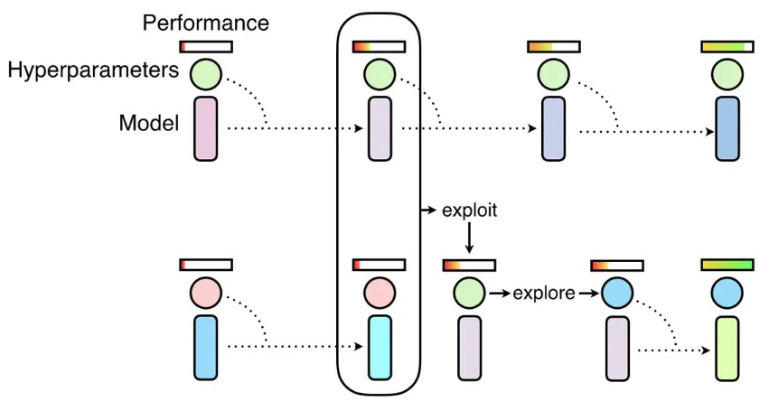

PBT Tuner on NNI
===

## PBTTuner

Population Based Training (PBT) comes from [Population Based Training of Neural Networks](https://arxiv.org/abs/1711.09846v1). It's a simple asynchronous optimization algorithm which effectively utilizes a fixed computational budget to jointly optimize a population of models and their hyperparameters to maximize performance. Importantly, PBT discovers a schedule of hyperparameter settings rather than following the generally sub-optimal strategy of trying to find a single fixed set to use for the whole course of training. 



PBTTuner initializes a population with several trials (i.e., `population_size`). There are four steps in the above figure, each trial only runs by one step. How long is one step is controlled by trial code, e.g., one epoch. When a trial starts, it loads a checkpoint specified by PBTTuner and continues to run one step, then saves checkpoint to a directory specified by PBTTuner and exits. The trials in a population run steps synchronously, that is, after all the trials finish the `i`-th step, the `(i+1)`-th step can be started. Exploitation and exploration of PBT are executed between two consecutive steps.

### Provide checkpoint directory

Since some trials need to load other trial's checkpoint, users should provide a directory (i.e., `all_checkpoint_dir`) which is accessible by every trial. It is easy for local mode, users could directly use the default directory or specify any directory on the local machine. For other training services, users should follow [the document of those training services](../TrainingService/SupportTrainingService.md) to provide a directory in a shared storage, such as NFS, Azure storage.

### Modify your trial code

Before running a step, a trial needs to load a checkpoint, the checkpoint directory is specified in hyper-parameter configuration generated by PBTTuner, i.e., `params['load_checkpoint_dir']`. Similarly, the directory for saving checkpoint is also included in the configuration, i.e., `params['save_checkpoint_dir']`. Here, `all_checkpoint_dir` is base folder of `load_checkpoint_dir` and `save_checkpoint_dir` whose format is `all_checkpoint_dir/<population-id>/<step>`.

```python
params = nni.get_next_parameter()
# the path of the checkpoint to load
load_path = os.path.join(params['load_checkpoint_dir'], 'model.pth')
# load checkpoint from `load_path`
...
# run one step
...
# the path for saving a checkpoint
save_path = os.path.join(params['save_checkpoint_dir'], 'model.pth')
# save checkpoint to `save_path`
...
```

The complete example code can be found [here](https://github.com/microsoft/nni/tree/master/examples/trials/mnist-pbt-tuner-pytorch).


### Limitations

The current implementation only supports search space types in `float`, including `uniform`, `normal`. The support of other search space types is ongoing.

Importing data has not been supported yet.